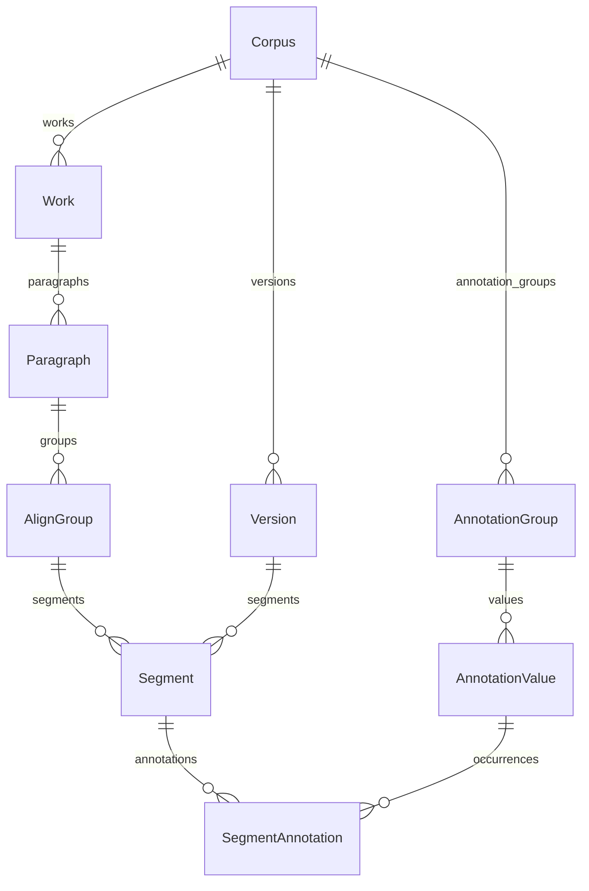

# 语料数据结构与 AI 自动标注开发指南

适用项目：RuCorpus 开源软件版（不附带语料或标注记录）。核对日期：2026-10-06。

本文中的短句和 JSON 为人工构造的技术示例，不是正式语料或金标准标注。仓库不包含任何实际语料、实际标签关系或账号数据库。

本文是交给后续 AI 开发者的数据契约：读完后，应能理解语料层级、建立新的标注体系、编写分段切句与标注算法，并选择正确的导入方式。本文不介绍界面功能。具体标注项由语料设计者提供，文中的语言学类别只是结构示例，不替代其研究定义。

文中 **“现有实现”** 指当前代码确实支持的行为；**“新任务规范”** 是新自动标注工作应采用的约定；**“需开发”** 指目前没有对应字段、导入器或流程。尤其不能把后文建议的 JSONL 直接交给现有导入接口。

## 1. 先掌握这十条约定

1. 一个 `Corpus` 是一个子语料库，拥有自己的语言方向、作品、版本和标注体系。
2. `Work` 是作品，`Version` 是原文或译文的版本。两者都属于子库；**版本不是作品的子表**。
3. 作者、译者是字符串元数据，没有单独的作者表、译者表，也没有现成的“作品—版本”关联表。
4. `Paragraph` 是作品内跨译本共用的段落容器；`AlignGroup` 是段内的对齐句组；`Segment` 是某个译本的一条原文—译文对应记录。
5. **一条 Segment 不保证等于一个语言学句子。** 它可以容纳多句原文或多句译文；不同译本可以有不同切分。
6. 标注挂在 `Segment` 上，不直接挂在作品、段落、对齐句组、单词或独立原文句子上。
7. 标注体系只有两层：`AnnotationGroup`（标注项组）→ `AnnotationValue`（具体标注项）。实际命中保存在 `SegmentAnnotation`。
8. 原文/译文由 `source`、`target` 表示；俄语/汉语由语言字段确定。**不能假设 source 永远是俄语。**
9. 数据库与标准 JSON 的序号从 **0** 开始；Excel/CSV 的“段落、句组、句序”从 **1** 开始。ID 与序号用途不同。
10. 现有表格导入不是无损的 AI 结果导入器。需要保留 AI 来源、方法、证据、置信度时，应另写结果适配器，或通过 Django ORM 明确写入这些字段。

## 2. 层级、实体与对应关系



这里有两条独立的“组”关系：

- **对齐句组 `AlignGroup`** 组织原文、译文的对应范围。
- **标注项组 `AnnotationGroup`** 组织标签词表，例如“语法形式”之下有若干具体形式。

`Segment.group_id` 指向对齐句组；`AnnotationValue.group_id` 指向标注项组。不要混用这两个 ID。

### 2.1 原文、译文、译者、作品版本怎样连接

以多译本子库为例：一个作品只有一条 `Work`，各译者对应不同 `Version`；每条译文记录通过 `Segment.version_id` 找到译本名称、译者和书目信息，通过 `Segment.work_id` 找到作品。

```text
某个 Segment
  ├─ work_id → Work → 作品原题、译题、原作者
  ├─ version_id → Version → 译本名称、译者、语言、出处
  ├─ group_id → AlignGroup → Paragraph → 作品内段落位置
  ├─ source → 该译本切分方式下的原文片段
  └─ target → 与该片段对应的译文
```

一个子库通常有一个 `kind=source` 的原文版本和若干 `kind=translation` 的译文版本。**常规平行语料导入中，原文版本可只存书目元数据，不另存一套原文 Segment。** 原文实际重复保存在各译本记录的 `source` 中。

由此产生的边界：

- 没有 `source_version_id` 将某个句对显式连接到某一种原文底本；同子库的版本共用同一原文基础是当前数据的约定，不是完整的多底本建模。
- `Version` 的书目与译者是子库范围的。若同一译者有多个出版版本，应建立不同的 Version，不能只按译者名合并。
- 不同作品是否拥有某个译本，由实际 Segment 推导；数据库没有要求每部作品必须拥有全部版本。
- `title_target` 只有一个字符串，不能完整记录“每个译本各自的作品译名”。
- 多底本、多章层级、页码、ISBN、多人合译、逐作品的版本书目信息等，当前没有专门结构；新任务有这些需求时，应先设计扩展或外部清单。

## 3. 当前数据库字段字典

业务模型定义在 `backend/corpus/models.py`。所有表都有整数主键 `id`（Django `BigAutoField`）；普通新增由数据库分配，标准 JSON 加载器可以指定 ID。不同表可以出现同一个整数 ID，但同一表内必须唯一。

下表中的外键名称是数据库/ORM 常用的 `*_id` 形式；Django 模型属性本身为 `corpus`、`work` 等。字符串长度是模型声明的上限，批处理写入前仍须主动校验，不能依赖 SQLite 自动检查全部业务规则。

### 3.1 子库、版本、作品

| 实体 | 字段 | 类型与含义 |
| --- | --- | --- |
| Corpus | `name` | 字符串，最长 200；子库名称 |
| Corpus | `description` | 长文本，可空；子库说明 |
| Corpus | `source_lang`, `target_lang` | 字符串，最长 10；可使用 `ru`、`zh`、`en`、`fr`、`es` 等，默认分别为 `ru`、`zh` |
| Corpus | `status` | `published` / `hidden`；数据发布状态 |
| Corpus | `sort_order` | 整数；子库排序 |
| Corpus | `created_at`, `updated_at` | 自动维护的创建、更新时间 |
| Version | `corpus_id` | 所属子库外键 |
| Version | `kind` | `source` / `translation`；原文版本或译文版本 |
| Version | `lang` | 字符串，最长 10；这个版本的语言 |
| Version | `label` | 字符串，最长 200；版本名称，例如某译者某出版社版本 |
| Version | `person` | 字符串，最长 200，可空；原作者或译者 |
| Version | `bibliography` | 字符串，最长 1000，可空；出处与书目信息 |
| Version | `sort_order` | 整数；版本排序 |
| Work | `corpus_id` | 所属子库外键 |
| Work | `title_source` | 字符串，最长 500；原文作品标题 |
| Work | `title_target` | 字符串，最长 500，可空；一个代表性的译文标题 |
| Work | `author` | 字符串，最长 200，可空；作品原作者 |
| Work | `sort_order` | 整数；子库内作品排序 |

`Corpus.name`、`Version.label`、`Work.title_source` 没有数据库唯一约束，但部分导入逻辑按名称匹配它们。**新任务应保证同子库版本名称、作品原题不发生歧义**；同名作品应先建立独立键与明确的消歧名称。

### 3.2 段落、对齐句组、句对

| 实体 | 字段 | 类型与含义 |
| --- | --- | --- |
| Paragraph | `work_id` | 所属作品外键 |
| Paragraph | `seq` | 作品内段落序号，0 起；`(work_id, seq)` 唯一 |
| AlignGroup | `paragraph_id` | 所属段落外键 |
| AlignGroup | `seq` | 段落内对齐句组序号，0 起；`(paragraph_id, seq)` 唯一 |
| AlignGroup | `work_id`, `corpus_id` | 冗余外键，用于过滤和排序；必须与段落所属作品、子库一致 |
| AlignGroup | `position` | 作品内所有句组的连续阅读序号，0 起，跨段递增；有索引，无唯一约束 |
| Segment | `group_id` | 所属对齐句组外键 |
| Segment | `version_id` | 所属版本外键；现有平行语料指向译文版本 |
| Segment | `seq` | **同段落、同版本内**的句对序号，0 起；进入下一个句组时不重置，进入下一段才重置 |
| Segment | `source` | 长文本；原文片段 |
| Segment | `target` | 长文本，可空；对应译文片段 |
| Segment | `unsplit` | 布尔值，默认 false；true 表示整段尚未完成句对切分 |
| Segment | `work_id`, `corpus_id` | 冗余外键，必须与对齐句组、版本的归属一致 |
| Segment | `updated_at` | 自动更新时间；部分批量 `.update()` 路径不会自动刷新，不能单独用它证明文本未变 |
| Segment | `annotations` | 通过 SegmentAnnotation 建立的多对多关系，不是文本列 |

当前没有独立的 `Sentence` 表、原文段落全文字段、译文段落全文字段或字符起止位置字段。Paragraph 和 AlignGroup 都是组织容器，不持有正文。

API 中某些句组的 `source` 是临时拼出来的：选该组内原文总字符数最多的版本，将其各 Segment.source 用空格连接。**它不是数据库中的权威原文全文，不能用作精确字符位置的基准。**

`unsplit=true` 只说明切分状态，不表示低置信标注、漏译或无标注。当前表格交换不携带该字段；需要保留时用标准 JSON 或专门适配器。

### 3.3 标注体系与实际标注

| 实体 | 字段 | 类型与含义 |
| --- | --- | --- |
| AnnotationGroup | `corpus_id` | 所属子库外键 |
| AnnotationGroup | `key` | 字符串，最长 100，可空；内部键，数据库不保证唯一 |
| AnnotationGroup | `name` | 字符串，最长 100；组名；`(corpus_id, name)` 唯一 |
| AnnotationGroup | `description` | 字符串，最长 500，可空；简要定义，不足以容纳完整标注手册 |
| AnnotationGroup | `widget` | `checkbox`、`radio`、`select`、`multiselect` |
| AnnotationGroup | `sort_order` | 整数；组排序 |
| AnnotationValue | `group_id` | 所属标注项组外键 |
| AnnotationValue | `label` | 字符串，最长 200；具体标签；`(group_id, label)` 唯一 |
| AnnotationValue | `sort_order` | 整数；组内排序 |
| AnnotationValue | `defined_in_legacy` | 布尔值；历史词表是否定义该项，**不是是否人工标注或是否有效** |
| SegmentAnnotation | `segment_id`, `value_id` | 句对与标注项外键；这两个字段的组合唯一 |
| SegmentAnnotation | `origin` | `human` / `ai`，默认 `human` |
| SegmentAnnotation | `method` | 字符串，最长 40，可空；算法/方法标识 |
| SegmentAnnotation | `evidence` | 字符串，最长 300，可空；证据文本摘要，**不是结构化跨度** |
| SegmentAnnotation | `confidence` | 字符串，最长 8，可空；现有自动标注使用 `high`、`medium`，不是数值概率 |
| SegmentAnnotation | `replaced_id` | 可空，指向 AnnotationValue；表示这条 AI 标注替换过哪个人工标签 |

多选组为 `checkbox` / `multiselect`；单选组为 `radio` / `select`。单选是应用规则，不是数据库约束；现有逐句标注与标注表格导入有校验，**不是所有批量写入路径都会校验**。新算法必须自行保证。

同一 Segment 内同一标签只能存一条；句中出现五个同类词，也不是五条 SegmentAnnotation。应把多个证据汇总，详细出现位置存于外部结果或新设计的跨度表。这个结构记录“该句对具有这个标签”，并不直接记录现象频次。

同名标签可以在不同组、不同子库出现。映射时使用完整路径 `(corpus_id, group.name, value.label)` 或已核对的 `value_id`；不要只用标签文字查找。

当前不存在标签级定义、适用语言/文本侧、排他关系、审核状态、批次号、模型版本、概率、字符跨度、完整修改历史等专门字段。`replaced_id` 只能回指一个原标签，不能替代完整审计记录；删除该原标签时此引用会变为 null。

## 4. 分段、切句和多译本对齐

### 4.1 对齐句组解决什么问题

假设一段原文是：

> Он вошёл. Увидев друга, он улыбнулся.

两个译本的句对切分可以是：

| 版本 | 段落内句序（内部值） | source | target | 对齐句组 |
| --- | --- | --- | --- | --- |
| 甲译本 | 0 | Он вошёл. Увидев друга, он улыбнулся. | 他走了进来，看见朋友便笑了。 | 0 |
| 乙译本 | 0 | Он вошёл. | 他进来了。 | 0 |
| 乙译本 | 1 | Увидев друга, он улыбнулся. | 看见朋友，他笑了。 | 0 |

这是一组中的三条 Segment，表示甲的一条与乙的两条共同覆盖同一原文范围。不能把甲的第二句硬配给乙的下一段，也不能为了统一行数改写译文。

若给“包含副动词”打标，甲的整条和乙的第二条会有此标签，乙的第一条没有。这也解释了为什么不能把某个标签不加区分地复制给整个 AlignGroup 内全部 Segment。

### 4.2 共同原文边界怎样计算对齐

现有 `backend/corpus/alignment.py::compute_groups()` 接收**同一段落内每个译本已经切好的 source 列表**：

```python
{
    version_a: [source_piece_a1, source_piece_a2, ...],
    version_b: [source_piece_b1, source_piece_b2, ...],
}
```

它的工作是求共同边界，不是根据语义自动生成译文对应关系：

1. 用 `alnum()` 构造比较字符串：只保留字母数字、转小写、`ё` 折叠为 `е`。
2. 计算每个版本各 source 片段在本段中的累计结束位置。
3. 选输入中的第一个版本为参考；若拼接字符串不同，用 `difflib.SequenceMatcher(autojunk=False)` 将其他版本边界映射到参考坐标，无法直接匹配的位置靠到后续匹配块。
4. 对所有版本结束位置取交集，并包含段尾；这些共同边界形成最细的共同分组。
5. 每个 Segment 放入覆盖其结束位置的那个组；组号压紧为连续整数。

这里取的是共同边界的**交集**，不是所有边界的并集。并集会在某译本的一条 Segment 中间产生它并没有提供的切分。

共同边界函数只处理已知属于同一原文段落的片段列表；调用者先建立段落对应。**它不是通用的跨语言段落对齐算法。** 翻译有并段、分段、删节时，不能直接复用这个前提。

### 4.3 新任务的文本准备与切分规范

以下是交给新算法的处理规范，不表示当前已有“一键从任意原文生成语料”的命令。

1. **保留输入原件。** 保存文件来源、编码、语言、作品与版本信息，以及原始字节的 SHA-256。另生成用于处理的 UTF-8 文本；OCR 修正、换行与空白处理均记录映射或修改记录。
2. **建立段落边界。** 文本空行、DOCX 段落节点等可以作为依据；排版软换行不是新段。标题、章节名、页眉页脚、脚注、对话、诗行采用明确规则，不要一律当正文或一律删除。
3. **段内切句。** 俄语可从 razdel/Natasha 候选边界开始，处理姓名缩写、`т. д.` 等缩略语、小数、序号、引号、破折号、对话与省略号；中文处理句末标点、后置引号、引文、对话和省略号。分号、冒号是否断句由任务定义决定。
4. **保留标点与原始词形。** 小写化、词形还原、去标点只用于分析副本，不写回正文。保留 `ё`、`« »`、中文间隔号等真实字符。
5. **记录稳定位置。** 在中间文件中保存段落序号、句子序号、字符区间和正文哈希；段落/句子合并或拆分后生成新的切分版本与映射，不沿用已失效的位置。
6. **给出可核对的覆盖关系。** 每个正文字符应能归入一个片段或已声明的空白/分隔符；不能无记录地漏字、重复、换序或跨段拼接。不得把模型改写后的句子当原文。

推荐统一用 Python 字符串语义的 **Unicode 码点下标、0 起、左闭右开 `[start, end)`**。坐标必须注明相对于“处理后全文”“段落原文”还是“当前 Segment 文本”，不可混用；浏览器 UTF-16 下标与 UTF-8 字节位置不能直接拿来替代。

### 4.4 有译文时如何建立句对

先做段落对应，再在每个译本自己的段内建立原文—译文对应范围，允许 1:1、1:N、N:1、N:M；最后再计算多译本共同的 AlignGroup。语义对齐模型、长度与标点只能提供候选，低可信、删节、倒装重排和底本差异要单独记录。

现有 Segment 只有两段字符串，无法表达带位置的复杂重排。只含译文而无原文的 0:N 记录也不能直接通过当前语料表格导入，因为它要求原文非空。遇到这些情况，应保留外部对齐信息或扩展模型，不能编造一个原文片段凑数。

句数相等不构成语义对齐正确的证明；原文与译文的对齐须另做覆盖与语义检查。开源版不附带旧数据专用的自动切分或修复脚本。

### 4.5 只有原文时怎么办

只有原文时，可以完成：作品/原文版本整理 → 分段 → 切句 → 词法/句法分析 → 原文侧标签与证据。不能完成：真实译本信息、译文侧修辞判断、增译/减译等翻译关系判断。

推荐先生成第 8 节的独立原文单元与标注结果，保留全部证据，等真实译文到位后对齐、映射到 Segment。即使以后不补译文，这些文件也能作为单语标注数据继续使用。

**现有模型没有正式的“仅原文单元”工作流。** 虽然 `target` 允许空、数据库也没有禁止 Segment 关联 source 版本，但这不等于系统已经完整支持单语原文入库。不要虚构一个译者或译本来填外键，也不要把机器生成译文冒充出版译文。

如果需要原文阶段直接进入当前数据库，应先开发、验证一种明确的原文单元承载方式；长期可以扩展独立原文单元与句对映射，短期可以保留旁置文件并写映射适配器。本文只定义衔接要求，不声称已完成这项扩展。

## 5. 标注项组和标注项应怎样定义

设计者负责给出标签体系与语言学标准；AI 开发者负责把它转换为可执行、可验证的判断。仅有组名与标签名不足以确定算法。

每个任务应随语料提供一份 `annotation_scheme.json` 或 Markdown 标注手册，至少约定：

| 要素 | 必须说明的内容 |
| --- | --- |
| 体系版本 | 名称、版本号、变更说明；规则改变后不能混用旧结果 |
| 组与项 | 稳定组键、组名、各项名称；与数据库 ID 的映射 |
| 分析侧 | `source`、`target`、`pair`，并指定实际语言；不要从中文组名猜语言 |
| 判定单位 | 词、短语、分句、句子、段落或翻译对应关系；怎样聚合为 Segment 标签 |
| 选择约束 | 单选/多选、互斥、包含、依赖关系；约束是作用于词还是整条 Segment |
| 正负定义 | 纳入条件、排除条件、正例、反例、歧义例和边界情况 |
| 上下文范围 | 是否允许读取邻句、整段或作品背景；哪些内容可作为证据 |
| 无命中与不确定 | 没有该现象、算法不适用、缺译文、未处理、低置信等状态如何区分 |
| 输出证据 | 证据侧、词/片段、位置、方法、置信等级与复核条件 |

注意“某个词只有一种体”和“整条句对只有一种体标签”不是同一约束。一条 Segment 内可以有多个词、多个分句，不应仅凭语言学分类互斥就把整个组设为单选。

以下是**建议的外部规范示例，不是现有导入格式**：

```json
{
  "scheme_version": "demo-1.0",
  "groups": [
    {
      "key": "nonfinite",
      "name": "非变位形式",
      "side": "source",
      "language": "ru",
      "unit": "token",
      "aggregate_to_segment": "any_confirmed_occurrence",
      "widget": "checkbox",
      "values": [
        {
          "label": "副动词",
          "definition": "按本任务确认的俄语副动词判定标准识别。",
          "positive_examples": ["Увидев друга, он улыбнулся."],
          "negative_examples": ["Он видит друга."],
          "ambiguity_policy": "词典结果与上下文冲突时标为待复核，不自动落库。"
        }
      ]
    }
  ]
}
```

其中 `side`、`language`、`unit`、`scheme_version`、项定义等不是当前 AnnotationGroup/AnnotationValue 的字段，必须保存在外部规范或经迁移新增。新任务应保证 `key` 稳定且唯一；当前数据库不会自动替你保证。

## 6. 当前可用的导入、导出路径

### 6.1 三种用途必须区分

| 路径 | 适合用途 | 重要边界 |
| --- | --- | --- |
| 你提供的标准 JSON → `load_corpus` | 从完整结构数据初始化数据库，保留指定 ID | 不追加现有子库；只有标签 ID 列表，没有 AI 溯源结构 |
| 管理用 XLSX/CSV | 新建子库/追加新作品，或按句对 ID 更新标签 | 名称匹配、序号转换、部分元数据与 AI 信息不保真 |
| Django ORM / 新开发的批处理适配器 | 自动标注结果精确写回，保留 AI 字段 | 需要实现归属、冲突、单选、幂等、哈希校验与审计 |

数据库备份保存完整运行数据，但不是给模型逐条生成标注的交换格式。面向阅读的结果表也不是管理导入模板：它缺少稳定句对 ID，且把标签合在一列，不能直接作为无损往返格式。

### 6.2 标准语料 JSON：现有加载器契约

顶层有七个数组：`corpora`、`versions`、`annotation_groups`、`works`、`paragraphs`、`groups`、`segments`。这里的 `groups` 专指 AlignGroup。

| 数组 | 加载器读取的字段 |
| --- | --- |
| `corpora` | `id, name, description, source_lang, target_lang, status, sort_order` |
| `versions` | `id, corpus_id, kind, lang, label, person, bibliography, sort_order` |
| `annotation_groups` | `id, corpus_id, key, name, widget, sort_order, values` |
| 组内 `values` | `id, label, sort_order, legacy_defined` |
| `works` | `id, corpus_id, title_source, title_target, author, sort_order` |
| `paragraphs` | `id, work_id, seq` |
| `groups` | `id, paragraph_id, seq` |
| `segments` | `id, group_id, version_id, seq, source, target, annotations`；`unsplit` 可选，默认 false |

除明确可选的 `unsplit` 外，上述字段应全部提供。字符串无值时填 `""`，数组无值时填 `[]`，不要靠省略字段触发模型默认值。`annotations` 是 AnnotationValue ID 数组，不是名字，也不是包含证据的对象数组。

加载器还会：

- 根据段落→作品→子库关系推导 AlignGroup/Segment 的 `work_id`、`corpus_id`。
- 按作品、段落序号、句组序号计算 `AlignGroup.position`。
- 将 JSON 中的 `legacy_defined` 写入数据库的 `defined_in_legacy`。
- 重建全文索引。

JSON 中额外添加 `legacy`、`from_paragraph` 等追溯信息时，加载器不会写入对应业务字段；`AnnotationGroup.description` 也没有在此加载器中读取。不要误认为文件里多加任意字段就会自动持久化。

**该加载器创建的 SegmentAnnotation 一律走默认 `origin=human`。** 即使 JSON 旁边写了 `origin=ai`，加载器也不会读取。新 AI 项目可以先用 `annotations: []` 导入结构，再由适配器写入 AI 结果。

下面是结构完整的最小示例。作品、译者和文本均为演示数据；示例标签只演示位置关系，不应作为人工标注来源声明直接用于正式项目。

```json
{
  "corpora": [
    {"id": 101, "name": "结构演示库", "description": "演示多译本不同切分", "source_lang": "ru", "target_lang": "zh", "status": "hidden", "sort_order": 0}
  ],
  "versions": [
    {"id": 201, "corpus_id": 101, "kind": "source", "lang": "ru", "label": "演示原文", "person": "示例作者", "bibliography": "演示数据", "sort_order": 0},
    {"id": 202, "corpus_id": 101, "kind": "translation", "lang": "zh", "label": "甲译本", "person": "示例译者甲", "bibliography": "演示数据", "sort_order": 1},
    {"id": 203, "corpus_id": 101, "kind": "translation", "lang": "zh", "label": "乙译本", "person": "示例译者乙", "bibliography": "演示数据", "sort_order": 2}
  ],
  "annotation_groups": [
    {"id": 301, "corpus_id": 101, "key": "nonfinite", "name": "非变位形式", "widget": "checkbox", "sort_order": 0,
     "values": [{"id": 401, "label": "副动词", "sort_order": 0, "legacy_defined": false}]}
  ],
  "works": [
    {"id": 501, "corpus_id": 101, "title_source": "Пример", "title_target": "示例", "author": "示例作者", "sort_order": 0}
  ],
  "paragraphs": [{"id": 601, "work_id": 501, "seq": 0}],
  "groups": [{"id": 701, "paragraph_id": 601, "seq": 0}],
  "segments": [
    {"id": 801, "group_id": 701, "version_id": 202, "seq": 0, "source": "Он вошёл. Увидев друга, он улыбнулся.", "target": "他走了进来，看见朋友便笑了。", "annotations": [401]},
    {"id": 802, "group_id": 701, "version_id": 203, "seq": 0, "source": "Он вошёл.", "target": "他进来了。", "annotations": []},
    {"id": 803, "group_id": 701, "version_id": 203, "seq": 1, "source": "Увидев друга, он улыбнулся.", "target": "看见朋友，他笑了。", "annotations": [401]}
  ]
}
```

在已经迁移过的**空白临时数据库**中，加载命令为：

```text
python manage.py load_corpus path/to/dataset.json
```

命令在 `backend` 目录、项目虚拟环境下运行。数据库只要已有 Corpus 就会拒绝普通加载；`--replace` 会删除全部子库及其关联语料、标注等数据再重建。**它不是更新单个子库或追加 AI 标注的开关，不能对正在使用的数据随意执行。** 当前不存在与它配套的“一键导出实时数据库为同格式 JSON”命令。

### 6.3 管理用 Excel/CSV：现有表格格式

`句对` 工作表固定列顺序：

```text
句对ID | 作品 | 段落 | 句组 | 版本 | 句序 | 原文 | 译文 | 标注组A | 标注组B | …
```

每行一条 Segment。`作品` 使用 `Work.title_source`，`版本` 使用 `Version.label`。标注组列名必须与组名一致，格内填写标签名，多项用中文分号 `；` 分隔。解析器也接受 `; , ， 、` 和换行；因此新标签不要包含这些分隔字符，组名也不要与固定列同名。

以上述演示数据为例：

| 句对ID | 作品 | 段落 | 句组 | 版本 | 句序 | 原文 | 译文 | 非变位形式 |
| --- | --- | --- | --- | --- | --- | --- | --- | --- |
| 801 | Пример | 1 | 1 | 甲译本 | 1 | Он вошёл. Увидев друга, он улыбнулся. | 他走了进来，看见朋友便笑了。 | 副动词 |
| 802 | Пример | 1 | 1 | 乙译本 | 1 | Он вошёл. | 他进来了。 | |
| 803 | Пример | 1 | 1 | 乙译本 | 2 | Увидев друга, он улыбнулся. | 看见朋友，他笑了。 | 副动词 |

XLSX 另有这些工作表：

| 工作表 | 表头/内容 | 当前用途 |
| --- | --- | --- |
| `语料库` | `字段, 值`；字段有 `名称, 说明, 原文语言, 译文语言` | 新建子库的元数据 |
| `版本` | `名称, 类型, 语言, 作者/译者, 出处, 排序` | 类型用中文 `原文` / `译文` |
| `作品` | `原文标题, 译文标题, 作者, 排序` | 作品元数据 |
| `标注体系` | `标注组, 标注项, 控件` | 词表；当前导入不读取“控件”来恢复组属性 |
| `句对` | 固定列加各标注组列 | 正文和标注 |
| `说明` | 格式说明文字 | 无业务数据 |

CSV 只有句对表，没有其他工作表。导出为带 BOM 的 UTF-8，导入先尝试 `utf-8-sig`，再尝试 `gb18030`；新任务统一使用 UTF-8。XLSX 按单元格值读取，公式使用缓存值；算法应输出字面文本，不使用公式表示原文或标签。

### 6.4 语料导入与标注导入的不同语义

**语料导入 `kind=corpus`：**

- 用于新建子库或向选定子库追加新作品，忽略“句对ID”并分配新 ID。
- 新建子库需要 XLSX 的“语料库→名称”，默认建为 `hidden`；裸 CSV 适合向已存在的子库追加作品。
- 作品、版本、原文不能为空；段落必须为正整数。新数据应主动提供正确的句组、句序，不依赖宽松解析。
- 以作品原题、版本名称匹配；目标子库已有同名作品时拒绝导入，不支持用此路径给现有作品补一个新译本。
- 同作品、同段落、同句组的行放在同一 AlignGroup；缺“句组”时按“句序”分组。**这不是语义对齐**，多译本切分不同时必须自行提供句组。
- 段落、句组按输入数值排序后重编号为连续的内部序号；每版本句序在每段中重新连续分配。输入的稀疏编号不原样保留。
- 固定列之外的列都被当作标注组；新标签可能自动进入词表。拼写错误也可能变成新标签，不能把任意辅助列直接加进去。
- 新组默认 `checkbox`，不会恢复表中“控件”，也不保留组 key、description；作品表“排序”当前不用于 Work 的实际排序。版本已有时不会覆盖已有元数据。
- 新增标签关系默认 `human`，没有 AI 溯源；重复标签需预先去重，不能指望所有路径自动处理。

**标注导入 `kind=annotations`：**

- 对现有子库按“句对ID”匹配；不会根据作品名、行号或文本猜句对。ID 必须属于该子库，文件内不能重复。
- 表头仍需“原文”，即使只改标注；默认 `update_text=false`，不会修改原文/译文。
- 只更新文件里出现的已知标注组列；未出现的组保持原样。
- **某组列存在、某行该格为空，意味着清空这条句对在该组的标签。** 它不表示“未处理”“不确定”或“跳过”。
- 未知组列列入忽略清单；已知组中的未知标签、违反单选限制等会使该行跳过。
- `update_text=true` 才允许更新正文；不会重新计算段落/句组对应关系，文本变动后仍须重新检查对齐和原标注。
- 应用时删除差集标签、添加差集标签；新增关系默认 `human`。未变化的既有关系不重建，因此保留原来的 AI 字段。

AI 标签导出时在标签前加 `✦`。导入解析会去掉这个符号，**不会据此创建 `origin=ai`**。原文件不改动再导回原库时，既有 AI 标签可以因“没有差集”而保留；导到新库、新增或删后重建时，原 AI 方法、证据、置信度、替换关系都无法从表格恢复。

### 6.5 实际 API 与提交过程

这些路径用于程序访问数据，不需要读取前端源码。写入使用 Django 会话和 CSRF；表格导入不是无认证的上传接口。

| 请求 | 用途 |
| --- | --- |
| `GET /api/manage/transfer/export/{corpus_id}?format=xlsx` | 导出管理用完整工作簿；`format=csv` 为句对表 |
| `GET /api/manage/transfer/template/{corpus_id}` | 导出带体系、元数据但无句对行的模板 |
| `POST /api/manage/transfer/upload` | multipart：`kind, file, corpus_id, update_text`；返回任务和预览 |
| `POST /api/manage/transfer/jobs/{job_id}/commit` | 重新解析并提交该任务 |
| `GET /api/manage/transfer/jobs/{job_id}/errors` | 导出错误明细 |
| `GET /api/manage/corpora/{corpus_id}/annotation-groups` | 读取实际组/项及其 ID |

上传预览会保存 ImportJob 和上传文件，但不修改语料。语料导入有错误时拒绝提交；标注导入会应用有效行、跳过错误行。因此 AI 程序应检查预览中的错误数、忽略列、增加/删除数量，并在提交后核对结果，不能只看到 HTTP 200 就断言“全部数据已导入”。文件上限为 50 MiB。

普通逐句 `PUT /api/segments/{id}/annotations` 与批量标注接口也是人工编辑语义，不接收完整 AI 溯源字段。`confirm_ai=true` 可将保留的 AI 标注改为 human；**不要把它用作机器结果的导入开关**。

## 7. 现有自动标注代码可复用什么

### 7.1 当前算法入口与范围

入口为 `backend/corpus/management/commands/ai_annotate.py`，调用 `corpus.ai.run.run()`。命令在 backend 目录运行：

```text
python manage.py ai_annotate
```

这是一组规则与 NLP 模型组成的批处理，不是调用大语言模型后自动理解任意标签体系。它依据**固定组名、标签名**触发算法；新设计的标注体系不会仅靠新增数据库记录就获得相应算法。

| 文件/方法 | 当前做法 | 开发新任务时应知道的限制 |
| --- | --- | --- |
| `ai/morphology.py` | pymorphy3 词形分析；副动词、形动词、命令式、述谓词等 | 采用词典已知词的最高分分析，排除部分名词同形词；不能替代完整语境消歧 |
| `ai/syntax.py` | Natasha/slovnet 依存分析，识别无主语分句候选 | 虽然分类器计算若干类型，当前入库只使用“确定人称句” |
| `ai/chinese.py` | jieba 分词、词表和结构规则识别叠词、四字格、象声词 | 有排除词表，定义属于当前任务，不能无条件迁移到新研究 |
| `RUCORPUS_IDIOMS_PATH` | 可选成语词表路径，一行一个词 | 不附带词表；用户自行提供有权使用的词表。未配置时仅启用内置结构规则，覆盖范围较小 |
| `ai/run.py` | 按子库语言方向选文本侧，合并证据、避免与已有人工标签重复、写统计 | 名称映射、人工更正和重跑行为需要特别检查 |

运行器对俄语侧按 `source_lang/target_lang` 选择，对中文侧也按语言选择。它没有独立的标注组 `side` 字段，例如当前“译文修辞”检测实际取中文侧；新任务不能只复制名称就假定它永远分析 target。

原文修辞、翻译技巧、正反义等没有现成的自动检测器。未出现自动标注不代表这些现象不存在。

### 7.2 当前 AI 结果怎样存

现有 method 包括 `morph.nonfinite`、`morph.forms`、`morph.fix`、`syntax.definite`、`zh.redup`、`zh.idiom`、`zh.sound`。同一句对同一标签的证据合并为文字，截断到 300 字符；confidence 为规则配置的等级，不是经校准的正确概率。

运行报告保存在 `MEDIA_ROOT/ai_annotation_report.json`。报告中的 `agreement = human_found / human_total` 是该检测器命中既有人工作业标签的比例，不是模型总体准确率，也不能代替精确率、召回率和新增标签抽查。报告不是标注全量导出。


### 7.3 重跑与更正的关键边界

**开源版 `ai_annotate` 只刷新 `METHODS` 中内置 method 的 AI 关系，并恢复这些关系 `replaced_id` 指向的人工标签。`--corpus ID` 可限定一个子库；省略时处理全部子库。外部算法必须使用独立 method 名称，避免复用内置方法名。**

运行报告只描述最近一次所选范围的运行，不是全库所有算法的统计。当前没有 run_id 字段，外部算法仍需自己实现批次清单、可重复写入与撤销。

现有自动更正针对少数形态标签的体、长尾/短尾冲突，会删除原人工标签，并用新 AI 关系的 `replaced_id` 记住它。新增算法默认应保留人工判断、输出冲突供复核；若设计者明确要求自动更正，仍需实现可靠的回退和完整变更清单。

现有拆分句对接口也需注意：首个片段保留原 Segment ID 和旧标签，后续片段为新 ID、没有标签，仍属于原 AlignGroup；接口不会自动重新分配标签或细化句组。拆分完成后要重新检查全部子片段，不能把旧标签默认视为首句正确标注。

## 8. 给新 AI 任务的中间数据与结果契约（需开发适配器）

这一节定义推荐交付形式，用于减少模型需要读取的上下文。**以下文件不是现成的系统导入格式。** 其作用是保留当前数据库表达不了的切分、证据与批次信息，然后通过一次明确映射写入现有模型。

### 8.1 输入文件最小集合

```text
task/
  manifest.json             作品、语言、原文版本/译本元数据、文件哈希、任务版本
  source.txt                完整原文；或按作品分别存放
  translations/             有真实译文时提供；没有则省略
  annotation_scheme.json    设计者的组/项定义、适用侧、约束与示例
  units.jsonl               算法生成的段落/句子单元与稳定位置
  annotations.jsonl         算法结果与证据
  id_map.jsonl              外部单元到数据库 Segment/组/版本 ID 的映射
  run_report.json           数量、异常、复核项、模型/规则版本及评估
```

最初只有 `source.txt` 与设计者的标注规范，也可以开始生成 units 和原文侧结果。作者、出处等没有可靠依据时保持未知并列入待补充元数据，不能由 AI 猜造。真实译文以后补入时，重新建立对齐与 ID 映射。

### 8.2 原文单元示例

JSONL 是每行一个 JSON 对象；下列缩进仅方便阅读，保存时每条记录应写成一行。

```json
{
  "unit_key": "demo-work:source-v1:p000001:s000002",
  "work_key": "demo-work",
  "source_version_key": "source-v1",
  "segmentation_version": "split-1.0",
  "paragraph_seq": 0,
  "sentence_seq": 1,
  "language": "ru",
  "text": "Увидев друга, он улыбнулся.",
  "span_in_paragraph": [10, 37],
  "offset_unit": "unicode_codepoint",
  "text_sha256": "<该 text 的 UTF-8 字节 SHA-256>"
}
```

该例的段落正文就是第 4 节的 `Он вошёл. Увидев друга, он улыбнулся.`，区间 `[10, 37)` 指向第二句。外部 key 中 `p000001/s000002` 是可读编号，内部 `paragraph_seq/sentence_seq` 仍为 0 起；key 一经分配不因展示排序而复用给另一段文字。

建议输出所有分析单元，包括“分析完成但无命中”的单元。仅返回有标签的行会让后续无法区分“没有现象”和“根本没跑到”。

### 8.3 已有句对上的 AI 结果示例

```json
{
  "format_version": 1,
  "run_id": "demo-run-001",
  "scheme_version": "demo-1.0",
  "unit_ref": {"segment_id": 803},
  "text_sha256": "<按下方 source/target 算法计算的 SHA-256>",
  "status": "completed",
  "annotations": [
    {
      "group": "非变位形式",
      "label": "副动词",
      "side": "source",
      "method": "ru.nonfinite.v1",
      "confidence": "high",
      "evidence": [{"start": 0, "end": 6, "text": "Увидев"}]
    }
  ]
}
```

`segment_id=803` 引用第 6.2 节演示句对。证据位置相对于该 Segment 的 source，不是整段正文，所以从 0 起。写入前必须检查 `source[start:end] == evidence.text`。

只有原文、尚未入库时，`unit_ref` 改用 `{"unit_key": "..."}`，并校验 units 中的单元文本哈希；不能自行把这个字符串当数据库主键。结果用 `completed + annotations: []` 表示已处理无命中；用 `needs_review`、`not_applicable`、`error` 等外部状态区分歧义、缺译文和运行失败，并附原因。这些状态不直接映射为“清空数据库标签”。

对于既有句对，建议哈希覆盖 source 和 target，避免任务运行期间正文被修改却仍按旧结果写回：

```python
import hashlib
import json

def pair_text_sha256(source, target):
    payload = json.dumps(
        {"source": source, "target": target},
        ensure_ascii=False,
        sort_keys=True,
        separators=(",", ":"),
    ).encode("utf-8")
    return hashlib.sha256(payload).hexdigest()
```

哈希是文本版本检查，不替代 ID、子库归属和体系版本检查。只以全文相同来合并两个句对也不可靠，它们可能属于不同作品或不同译本。

### 8.4 适配到现有数据库

适配器应按以下顺序处理一个批次：

1. 读取任务与体系版本，定位目标子库，建立外部 key → 数据库 ID 的明确映射。
2. 对每条结果检查 Segment 存在、归属匹配、正文哈希一致；用完整标签路径映射 value_id；未知标签列为错误，不能静默造词。
3. 检查证据侧、位置、文本匹配、长度限制、组内单选、重复标签、缺失译文和不确定状态。
4. 在外部保留结构化证据、批次、模型/提示词/规则版本；数据库 `evidence` 只写简短摘要，不能把截断后的摘要当完整证据档案。
5. 通过事务写入 `SegmentAnnotation(segment_id, value_id, origin='ai', method, evidence, confidence, replaced_id=None)`；未经明确更正规则不删除人工标签。
6. 相同 `(segment_id, value_id)` 已有人工标签时保留它，在运行报告记录“与人工一致”，不要为记录机器命中而改写成人工来源消失的 AI 行。
7. 已有其他 AI 方法的同值关系时也不能重复插入；当前唯一约束不支持多模型并列溯源。应在外部记多模型结果，或先扩展 provenance 模型。
8. 重跑只处理自己负责的批次/方法和已完成单元。现有表没有 run_id，必须有外部清单或新增表；不要删除全部 AI 关系，不把中途失败误当作阴性结果。
9. 保存变更清单、数量和异常，完成数据库/输出核对。只有标签变化不需改全文索引；新增、修改、删除正文时必须同步索引。

原文侧标签映射到多译本 Segment 时，应根据原文跨度是否真正覆盖该证据决定，而不是按组统一复制。译文侧与 pair 侧标签属于特定译本，不能跨译本复制。统计原文现象时也需按原文单元去重，否则同一原文在多个译本中的重复存储会放大计数。

## 9. 自动标注算法的开发与验收顺序

### 9.1 开发顺序

1. **确认任务定义。** 读取本文与设计者的标注规范，列出每个组分析哪一侧、在哪个单位判断，以及所需数据是否齐全。
2. **准备代表性小样本。** 覆盖长句、对话、引文、缩写、多分句、多译本不同切分、无命中和边界例；先验证文本切分，再验证标注。
3. **分别设计检测器。** 词形现象可用词法工具，句法现象结合上下文/依存分析，翻译技巧需要真实双语对应。LLM 可以生成候选，但结果必须满足同一结构化契约与证据校验。
4. **保留不确定性。** 低可信歧义、无法定位的证据、非适用文本和工具错误分开输出；不要仅为提高覆盖率强行选择一个标签。
5. **批处理。** 模型输入只包含所需正文、有限上下文和相关标签定义；按不可变单元键关联输出，支持断点续跑。可按“文本哈希 + 规则/模型版本”缓存分析，但落库仍逐个核对句对归属。
6. **独立评价。** 对每组/每项分别统计精确率、召回率、遗漏、误报与不确定比例；用未参与调规则的样本检查泛化。人工既有标签可能不完整，不能直接把所有新增结果当误报，也不能当全部正确。
7. **验证映射后导入。** 先跑预览或 dry-run 变更清单，再按已确认的任务规则批量写入；保留批次结果和可回退数据。只改某几组时不要连带覆盖其他组。

### 9.2 入库前必须校验的数据不变量

这些要求有些由数据库约束保证，有些必须由新脚本实现，不能省略后者。

| 范围 | 校验条件 |
| --- | --- |
| 身份 | ID 在各自表内唯一；引用存在；已有记录不因排序改变而换 ID |
| 归属 | Segment、Version、AlignGroup、Work、Paragraph、AnnotationValue 沿关系最终指向同一个目标子库 |
| 顺序 | 段序、组序、每段每版本的句序、每作品 position 连续且从 0 起；不要跨组重置 Segment.seq |
| 正文 | source 非空；正文来自真实版本；target 缺失有明确原因；没有未记录的改写、漏字、重字或重排 |
| 对齐 | 每组代表同一原文范围；缺某版本要显式记录。“全部译本齐全”应由任务自己的校验规则决定 |
| 标注 | value 属于该子库；同句对同标签不重复；单选与其他体系约束满足；未知标签不自动变成新研究类别 |
| 证据 | 文本侧正确，跨度不越界，切片与证据文本一致；文本/切分版本匹配 |
| 来源 | 机器结果为 ai；人工结果不被冒充或静默覆盖；方法/体系/运行版本可追溯 |
| 完整性 | 输入、成功、无命中、待复核、失败、跳过数量能对账；不是只统计已插入标签数 |
| 重跑 | 同样输入与版本重复运行不产生重复关系；失败不扩大删除范围；能说明每条删除或更正的原因 |

当前数据库删除关系主要是级联：删除子库会删除其作品、版本、体系与关联正文；删除标注项会删除对应关系。因此不应采用“先删除旧体系再创建同名体系”的方式调整标签定义。批量替换、拆句和合并后也应重新核对映射。

全文索引 `segment_fts` 是从正文派生的辅助数据，rowid 对应 Segment.id；其词元不是金标准词法标注。需要全量重建时，在目标 backend 环境执行 `python manage.py rebuild_index`。不要把搜索用的全部候选词元直接当成已经消歧的形态分析结果。

## 10. 按需读取的源码入口

后续 AI 通常只需本文、具体任务语料和标注规范。实现某个适配器时，再读对应文件，不必重新扫描整个项目。

| 问题 | 精确入口 |
| --- | --- |
| 表字段、外键、约束 | `backend/corpus/models.py` |
| 标准 JSON 实际读入规则 | `backend/corpus/management/commands/load_corpus.py` |
| XLSX/CSV 表头、覆盖语义、重编号 | `backend/corpus/transfer.py`：`corpus_workbook`, `plan_corpus`, `apply_corpus`, `plan_annotations`, `apply_annotations` |
| 上传、预览、提交与错误处理 | `backend/corpus/api/transfer.py` |
| 同段原文片段共同边界 | `backend/corpus/alignment.py`：`compute_groups` |
| 当前 AI 调度、覆盖范围、来源与撤销 | `backend/corpus/ai/run.py` |
| 俄语词法 / 句法 / 中文规则 | `backend/corpus/ai/morphology.py`, `syntax.py`, `chinese.py` |
| AI 命令入口 | `backend/corpus/management/commands/ai_annotate.py` |
| 逐句标注及确认 AI 的含义 | `backend/corpus/api/public.py`：`set_annotations` |
| 句对拆分、标注体系编辑、批量修改 | `backend/corpus/api/manage.py` |
| 句组原文的临时拼接、AI 元信息返回 | `backend/corpus/serialize.py` |
| 正文索引维护 | `backend/corpus/fts.py`，`management/commands/rebuild_index.py` |
| 人工生成的测试、往返、来源、重跑用例 | `backend/tests/`；测试证明的范围以具体断言为准 |

## 11. 可直接交给下一个 AI 的任务说明

> 请先阅读《语料数据结构与 AI 自动标注开发指南》，以当前实现与本任务的标注规范为准，不需要读取前端源码。本文第 8 节是建议的中间格式，尚无现成导入器；请先判断本任务需要复用哪条导入路径或开发哪个适配器。
>
> 我会提供原文和标注项组/标注项设计；有译文时另行提供。请保持原文、版本信息与切分位置可追溯，先生成段落和句子单元，再开发各标签的检测器。只有原文时只做原文侧标注，把需要译文的项目记为不适用，不虚构译本或译文。
>
> 请明确 source/target、语言、Segment 与语言学句子的区别；保留不同译本的切分，通过共同原文范围建立对齐。所有机器标签都需要可核对的证据、方法、置信等级和任务版本；未知标签、歧义与失败单独报告。
>
> 交付分段切句结果、结构化标注、体系定义、ID 映射、运行与评估报告，以及需要的导入/导出适配器。导入前检查正文哈希、外键归属、单选约束和差集；保留人工标签。不得用 load_corpus --replace 追加标注，也不得用内置命令刷新外部算法的批次；为新算法使用独立 method 与批次清单。
